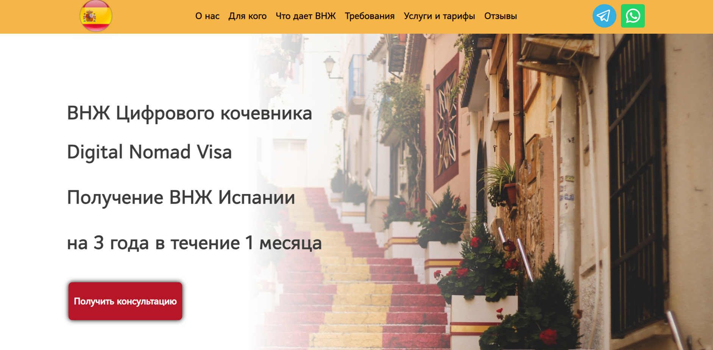

## Educational project(fe-80__group3)
***
### About the project

This project is the second final after the HTML & CSS course.
The purpose of the project was to create a landing Page for the customer providing immigration services.
The work was carried out without the participation of designers or the use of a website layout. But we took the following [site](https://canpassgroup.com/) with a similar theme for the prototype.
Project includes two adaptive versions.

***
### In the project we use:
* 
* 
* 
* 
* 
